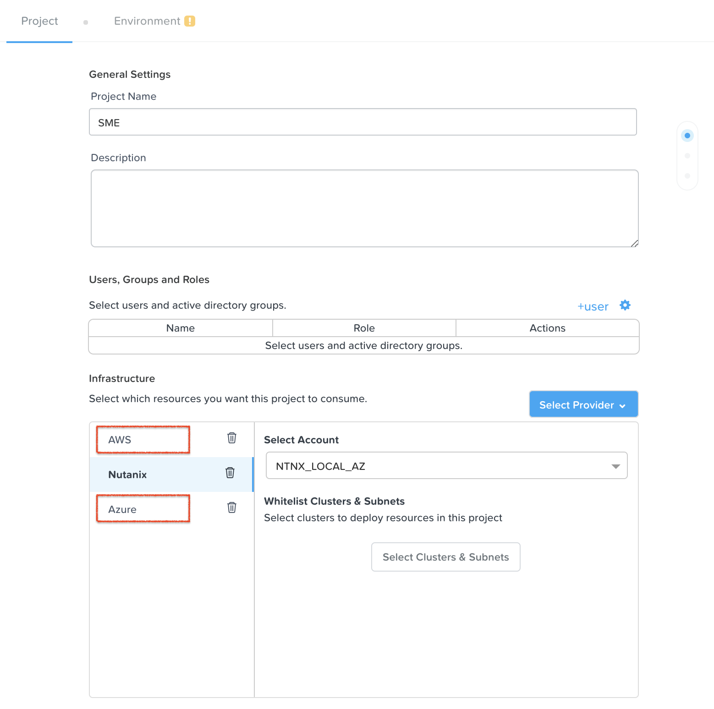

.. _calm_cloud_sdk:

================================================
Extending Calm automation with Public Cloud SDKs
================================================

.. note::

  This exercise requires to have an AWS or Azure account and its access keys or service principals.

.. note::

  Estimated time to complete: **60 MINUTES**

--------
Overview
--------

Out of the box Calm provides just virtual machine provisioning. When it comes to public cloud, many times there are other native services that are part of an application like could be *object storage*, *database services*, and others. 

Since Calm 2.9.7 the Python SDKs for AWS and Azure were included. With these SDKs Calm blueprints bring additional flexibility to include any public cloud service as part of your blueprint. As an example, you could have a WordPress application that uses EC2 instaces deployed by Calm natively, database using AWS RDS via AWS SDK in Calm, and a load balancer using AWS ELB or ALB.

---------------
Getting Started
---------------

AWS and Azure SDK can be accessed in Calm using eScript. The following two examples show how to enable the SDK in your eScript task or variable:

- **AWS**:

  .. code-block:: python

    import boto3

  For more details you can visit the `AWS Boto 3 documentation <https://boto3.amazonaws.com/v1/documentation/api/latest/index.html>`_

- **Azure**:

  .. code-block:: python

    from azure.common.credentials import ServicePrincipalCredentials

    # If we want to operate Azure Resource Groups, then we need to import the right module
    from azure.mgmt.resource import ResourceManagementClient

  For more details you can visit the `Azure Python documentation <https://docs.microsoft.com/en-us/python/api/?view=azure-python>`_

Lab
+++

You are going to build your personal blog using WordPress. The application will use the managed database service by AWS and Azure. Your blueprint includes:

- Two services: WordPress PHP and MySQL database
- WordPress PHP service is installed in a virtual machine using Calm providers
- MySQL service is based on AWS RDS and Azure Databases
- Single blueprint that uses two profiles to deploy on both clouds. One profile for AWS, another one for Azure.

.. note:

  AWS and Azure providers have been already configured for you.

1. Update project with public providers
***************************************

Update your Calm project to include the two providers, AWS and Azure. You don't need to configure them in the environment tab.

2. Create a multi-machine blueprint
***********************************

#. Name: **<INITIALS>-SDK**

   .. figure:: images/sdk_02.png

#. Create a credential for the operating system.

   - Name: **Cred_OS**
   - Username: **nutanix**
   - Secret Type: Password
   - Password: **nutanix/4u** 
   - Use as default: **Yes**

#. Create a credential for the database user.

   - Name: **Cred_DB**
   - Username: **mysql**
   - Secret Type: Password
   - Password: **Calm.123** 
   - Use as default: **No**

   .. figure:: images/sdk_03.png

3. Create WordPress service
***************************

#. Add a service with following settings:

   - Service Name: **Apache**

   - VM:

     - Name: **ApacheAWS**
     - Cloud: **AWS**
     - Account Id: <Depends on the setup>
     - Operating System: **Linux**
     - Instance Name: <Leave default>
     - Associate Public IP Address: **Yes**
     - Instance Type: **t2.micro**
     - Region: **eu-west-2**

     .. figure:: images/sdk_04.png

     - Availability Zone: **eu-west-2a**
     - Machien Image: **CentOS 7 x86_64**
     - IAM Role: <Empty>
     - Key Pairs: **id_rsa_OpenSSH**
     - VPC: **172.31.0.0/16 | vpc-29354341**
     - Security Group: **launch-wizard-1**
     - Subnet: **subnet-562eab2c | vpc-29354341**
     - User Data:

       .. code-block:: bash
   
         #cloud-config
         hostname: @@{name}@@
         users:
           - name: @@{Cred_OS.username}@@
             sudo: ['ALL=(ALL) NOPASSWD:ALL']
         chpasswd:
           list: |
             @@{Cred_OS.username}@@:@@{Cred_OS.secret}@@
           expire: False
         ssh_pwauth: True

     .. figure:: images/sdk_05.png

     - Leave the remaining default values
   
   - Click **Save**

#. Create Docker-based WordPress installation tasks.

   To make reusable the WordPress installation across Calm Profiles, AWS and Azure, the tasks must be created in the *Create* stage of the WordPress service.

   - On the left pane, expand **Service**, **Apache** and click **Create**
   - On the center of the screen, click **+ Task**
   - On the right pane, complete with:

     - Task Name: **Install Docker**
     - Type: **Execute**
     - Script Type: **Shell**
     - Credential: <empty> 
     - Script:

        .. code-block:: bash
     
          # Uninstall old versions
          sudo yum remove -y docker \
              docker-client \
              docker-client-latest \
              docker-common \
              docker-latest \
              docker-latest-logrotate \
              docker-logrotate \
              docker-engine

          # Set up the repository
          sudo yum install -y yum-utils
          sudo yum-config-manager \
              --add-repo \
              https://download.docker.com/linux/centos/docker-ce.repo

          # Install the latest version of Docker Engine
          sudo yum install -y docker-ce docker-ce-cli containerd.io

          # Enable and start Docker
          sudo systemctl enable docker
          sudo systemctl start docker

          # Add current user to Docker
          sudo usermod -aG docker $USER

        .. figure:: images/sdk_06.png

   - Add an additional task, click **+ Task**

     - Task Name: **Install WordPress**
     - Type: **Execute**
     - Script Type: **Shell**
     - Credential: <empty> 
     - Script: 
        .. code-block:: bash
     
          export WORDPRESS_DB_HOST=@@{MySQL.address}@@
          export WORDPRESS_DB_USER=@@{Cred_DB.username}@@
          export WORDPRESS_DB_PASSWORD=@@{Cred_DB.secret}@@

          docker run \
            --name calm-wordpress \
            --restart always \
            -p 80:80 \
            -e WORDPRESS_DB_HOST=$WORDPRESS_DB_HOST \
            -e WORDPRESS_DB_USER=$WORDPRESS_DB_USER \
            -e WORDPRESS_DB_PASSWORD=$WORDPRESS_DB_PASSWORD \
            -d wordpress

        .. figure:: images/sdk_07.png

   - Click **Save**

4. Create MySQL service
*************************

It is now when you are going to use the SDKs for AWS and Azure available in Calm. Because Calm is not responsible for deploying the database instance, we are going to use an **Existing Machine** service.

The database instance creation is delegated to the managed database service by AWS and Azure. In this first part you are going to focus on AWS RDS. Because you need to "pause" the WordPress service deployment until the database is ready, the MySQL SDK automation is configured during its **pre-create** stage.

#. Add a service with following settings:

   - Service Name: **MySQL**

   - VM:

     - Name: **MySQLAWS**
     - Cloud: **Existing Machine**
     - Operating System: **Linux**
     - IP Address: **@@{RDS_DB_IP}@@** | Look closely, this is a macro. During a pre-create task you will set a variable called **RDS_DB_IP** with the MySQL FQDN/IP address. The purpose is not for Calm to connect via SSH since that's not possible with RDS, it's to "pause" the WordPress installation until the MySQL instance is ready.
     - Check log-in upon create: **No**

     .. figure:: images/sdk_08.png

     - Leave the remaining default values
     - Click **Save** (Ignore any error)

#. Create AWS RDS MySQL with AWS SDK.

   https://boto3.amazonaws.com/v1/documentation/api/latest/reference/services/rds.html#RDS.Client.create_db_instance

   - On the left pane, expand **Service**, **Apache** and click **Create**
   - On the center of the screen, click **+ Task**
   - On the right pane, complete with:

     - Task Name: **RDS Create MySQL**
     - Type: **Set Variable**
     - Script Type: **EScript**
     - Output: **RDS_DB_IP** | This variable will get the FQDN/IP address of the RDS instance that is used by the **Existing Machine** IP address.
     - Script:
     
       .. code-block:: python

         AWS_ACCESS_KEY = '@@{AWS_ACCESS_KEY}@@'
         AWS_SECRET_KEY = '@@{AWS_SECRET_KEY}@@'
         AWS_REGION = '@@{AWS_REGION}@@'
         AWS_RDS_INSTANCE = '@@{calm_application_uuid}@@'
         MYSQL_USERNAME = '@@{Cred_DB.username}@@'
         MYSQL_PASSWORD = '@@{Cred_DB.secret}@@'

        import boto3
        from boto3 import setup_default_session

        setup_default_session(
            aws_access_key_id=AWS_ACCESS_KEY,
            aws_secret_access_key=AWS_SECRET_KEY,
            region_name=AWS_REGION
        )

        client = boto3.client('rds')

        response = client.create_db_instance(
            AllocatedStorage=5,
            DBInstanceClass='db.t2.micro',
            DBInstanceIdentifier=AWS_RDS_INSTANCE,
            Engine='MySQL',
            MasterUserPassword=MYSQL_PASSWORD,
            MasterUsername=MYSQL_USERNAME,
        )

        waiter = client.get_waiter('db_instance_available')
        waiter.wait(DBInstanceIdentifier=AWS_RDS_INSTANCE)

        response = client.describe_db_instances(DBInstanceIdentifier=AWS_RDS_INSTANCE)

        print("RDS_DB_IP={}".format(response['DBInstances'][0]['Endpoint']['Address']))

       .. figure:: images/sdk_09.png
