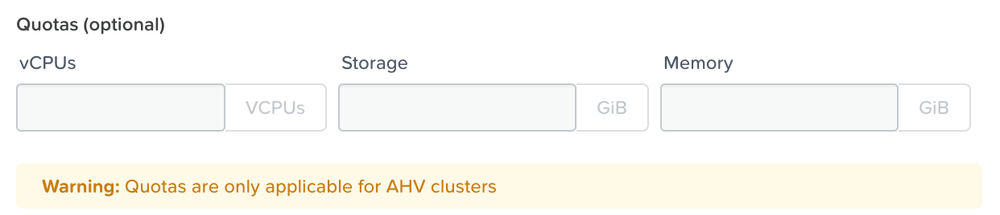

.. _calm_governance:

------------
Governance
------------

Overview
++++++++

.. note::

  Review :ref:`calm_basics` before proceeding with the lab to familiarize yourself with the UI and common terminology used in Nutanix Calm.

  Estimated time to complete: **15 MINUTES**

In this exercise you will configure the governance capabilities of Calm. A project can contain your Blueprints and Applications created throughout the workshop.

Starting with a Project
+++++++++++++++++++++++

Projects are the logical construct that allows an administrator to assign both infrastructure resources and the roles/permissions of Active Directory users/groups to specific Blueprints and Applications.

#. Within the Calm UI, Select |proj-icon| **Projects** from the sidebar.

   .. figure:: images/project_menu.png

#. Click + Create Project

#. Fill out the following fields:

   - **Project Name** - *initials*-Calm
   - **Description** - *initials*-Calm

Role-based Access Control
*************************

Calm uses Prism Central Authentication to retrieve Active Directory users and groups from a single domain integration to multi-domain environments. In this example we are using a single domain. In the event of several domains, make sure to click first the gear icon to set the domain to search.

The roles you are going to use are Calm built-in roles with pre-defined privileges (matrix link available at the end of the page). Custom roles with different privileges can be created in Prism Central and use them with Calm.

#. Under **Users, Groups, and Roles**, click **+ User**.

#. Fill out the following fields and click **Save**:

   - **Name** - SSP Admins
   - **Role** - Project Admin

#. Click **+ User**, fill out the following fields and click **Save**:

   - **Name** - SSP Developers
   - **Role** - Developer

#. Click **+ User**, fill out the following fields and click **Save**:

   - **Name** - SSP Power Users
   - **Role** - Consumer

#. Click **+ User**, fill out the following fields and click **Save**:

   - **Name** - SSP Basic Users
   - **Role** - Operator

   .. figure:: images/project_rbac.png

Hybrid/Multi-Cloud
******************

This is where you entitle a project what providers can be used when developing blueprints and deploying applications. First you have to configure your providers in the Providers section (Calm Settings -> Providers). Depending on the provider types configured, they will become available in the drop-down list to be added in the project.

#. Under **Infrastructure**, click the blue **Select Provider** button, and then **Nutanix**.

#. In the box that appears, click the white **Select Clusters & Subnets** button, and in the pop-up, select your AHV cluster.  Once your cluster is selected, choose the **Primary** network, and if available, the **Secondary** network, and click **Confirm**.

   .. figure:: images/project_cluster_subnet_selection.png

#. Within the **Selected Subnets** table, select :fa:`star` for the **Primary** network to make it the default virtual network for VMs in the **Calm** project.

   .. figure:: images/project_providers.png

Quotas
******

Finally, to limit the amount of resources a project can use with its applications, you can set quotas (AHV only). We are not setting any on this workshop.

We have finished the process to configure our first project so we can start to develop our blueprints.

#. Click **Save**.

.. note::

  Click `here <https://portal.nutanix.com/#/page/docs/details?targetId=Nutanix-Calm-Admin-Operations-Guide-v297:nuc-roles-responsibility-matrix-c.html>`_ to view the complete matrix of default Calm roles and associated permissions.

Takeaways
+++++++++

- Nutanix Calm is a fully integrated component of the Nutanix stack. Easily enabled, highly available out of the box in a Scale Out Prism Central deployment, and takes advantage of non-disruptive One Click upgrades for new features and fixes.
- By using different projects assigned to different clusters and users, administrators can ensure that workloads are deployed the right way each time.  For example, a developer can be a Project Admin for a dev/test project, so they have full control to deploy to their development clusters or to a cloud, while having Read Only access to production projects, allowing them access to logs but no ability to alter production workloads.

.. |proj-icon| image:: ../images/projects_icon.png
.. |mktmgr-icon| image:: ../images/marketplacemanager_icon.png
.. |mkt-icon| image:: ../images/marketplace_icon.png
.. |bp-icon| image:: ../images/blueprints_icon.png
.. |blueprints| image:: images/blueprints.png
.. |applications| image:: images/blueprints.png
.. |projects| image:: images/projects.png