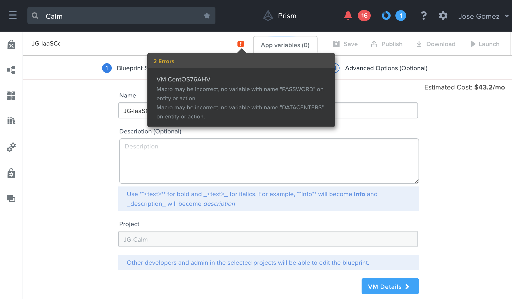

.. _calm_iaas:

---------------------------
Infrastructure as a Servic
---------------------------

.. note::

  Estimated time to complete: **30 MINUTES**

Overview
++++++++

The most common use case for starting a private cloud is Infrastructure as a Service. With Calm this can be done extremely quickly, providing the agility that IT is seeking and the time to market for the business. 

Linux VM Blueprint (CentOS)
+++++++++++++++++++++++++++

In this exercise you will explore the basics of Nutanix Calm by building and deploying a Blueprint that provision a Linux virtual machine with CentOS.

#. Within the Calm UI, select |blueprints| **Blueprints** in the left hand toolbar to view and manage Calm blueprints.

   .. note::

     Mousing over an icon will display its title.

#. Click **+ Create Blueprint > Single VM Blueprint**.

#. Fill out the following fields:

   - **Name** - *initials*-IaaSCentOS76
   - **Project** - *initials*-Calm

   .. figure:: images/calm_iaas_01.png

#. Click **VM Details >**

#. Fill out the following fields:

   - **Name** - *CentOS76AHV*
   - **Cloud** - *Nutanix*
   - **Operating System** - *Linux*

   .. figure:: images/calm_iaas_02.png

#. Click **VM Configuration >**

#. Fill out the following fields:

   - **VM Name** - @@{DATACENTERS}@@-centos-@@{calm_time}@@

   .. note::
      This defines the name of the virtual machine within Nutanix. We are using a macro (case sensitive) to use a variable value as input that we will create later. This approach can be used to meet your naming convention.

   - **vCPUs** - *2*
   - **Cores per vCPU** - *1*
   - **Memory (GiB)** - *4*
   - Select **Guest Customization**
   
     - Leave **Cloud-init** selected and paste in the following script
   
       .. code-block:: bash
   
         #cloud-config
         users:
           - name: centos
             sudo: ['ALL=(ALL) NOPASSWD:ALL']
         chpasswd:
           list: |
             centos:@@{PASSWORD}@@
           expire: False
         ssh_pwauth: True
   
   .. figure:: images/calm_iaas_03.png
   
   .. note::
      Observe the cloud-init config, there is another variable, @@{PASSWORD}@@, that we will create later. The way to reference macros/variables in Calm is with @@{<variable/macro name>}@@.
   
   - **Image** - CentOS_76
   - Select **Bootable**

   .. figure:: images/calm_iaas_04.png

   - Select :fa:`plus-circle` along **Network Adapters (NICs)**
   - **NIC 1** - <Your network>
   
   .. figure:: images/calm_iaas_05.png

#. Click **Save**

You will get an error when saving, and that's perfectly fine. If you have a look to the error icon near to **App variables (0)** you will find the reason.

Let's create the two variables we need.

#. Click **App variables (0)**

#. Click **+ Add Variable**

#. Add the following variables (**Runtime** is specified by toggling the **Running Man** icon to Blue):

   +-----------------------------------------------------------------------------------+------------------------------------------+
   |                                                                                   |          **Additional Options**          |
   +------------------------+-------------------------------+------------+-------------+----------------+--------------+----------+
   | **Variable Name**      | **Data Type** | **Value**     | **Secret** | **Runtime** | **Input Type** | **Value(s)** | **Mark** |
   +------------------------+-------------------------------+------------+-------------+----------------+--------------+----------+
   | DATACENTERS            | String        |               |            |     X       |   Predefined   |   LHR, MAD   |Mandatory |
   +------------------------+-------------------------------+------------+-------------+----------------+--------------+----------+
   | PASSWORD               | String        |  nutanix/4u   |     X      |     X       |     Simple     |              |Mandatory |
   +------------------------+-------------------------------+------------+-------------+----------------+--------------+----------+

   .. figure:: images/calm_iaas_07.png

   .. figure:: images/calm_iaas_08.png

#. Click **Done**

#. Click **Save**

Our first blueprint is ready to be launched. You can observe that if Showback has been enabled (Calm Settings -> Showback) the cost of a VM with the default resources is shown under *Launch*.

#. Click **Launch** at the top of the page.

#. Fill out the following fields:

   .. note::
      A single Blueprint can be launched multiple times within the same environment but each instance requires a unique **Application Name** in Calm.

   - **Name of the Application** - *initials*-IaaSCentOS-1
   - **DATACENTERS** - *your_choice*
   - **PASSWORD** - *any password*
   
   .. figure:: images/calm_iaas_09.png

#. Click **Create**

   You will be taken directly to the **Applications** page to monitor the provisioning of your Blueprint.

   .. figure:: images/calm_iaas_10.png

#. Click **Audit > Create** to view the progress of your application.

#. Click **Substrate Create > CentOS76AHV - Provision Nutanix** to view the real time output of the provisioning.

   .. figure:: images/calm_iaas_11.png

   Note the status changes to **Running** after the Blueprint has been successfully provisioned.

   .. figure:: images/calm_iaas_12.png

You can try opening the console and login in with the user *centos* and the password you provided.

Takeaways
+++++++++

- The Single VM Blueprint Editor provides a simple UI for modeling IaaS blueprints in less than five minutes.
- Blueprints are tied to Projects which can be used to enforce quotas and role-based access control.
- Variables allow another dimension of customizing an application without having to edit the underlying Blueprint.
- There are multiple ways of authenticating to a VM (keys or passwords), which is dependent upon the source image.
- Virtual machine status can be monitored in real time.

.. |proj-icon| image:: ../images/projects_icon.png

.. |mkt-icon| image:: ../images/marketplace_icon.png
.. |bp-icon| image:: ../images/blueprints_icon.png
.. |blueprints| image:: images/blueprints.png
.. |applications| image:: images/blueprints.png
.. |projects| image:: images/projects.png
